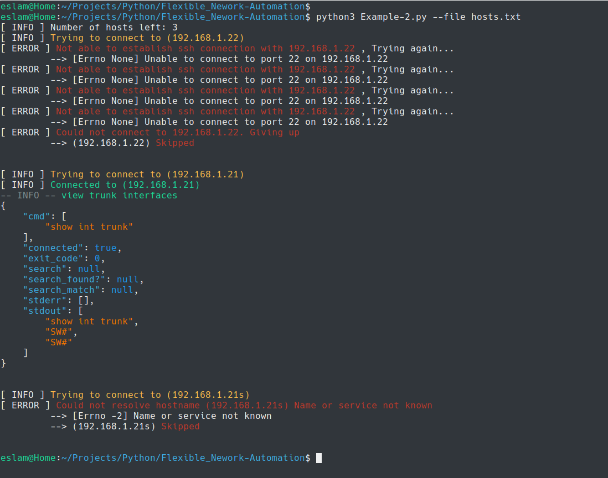

# Discussion


* In the Example Scripts, the code iterates over the hosts provided in the hosts file with the option  `--file` -  **and it's well controlled againest Errors**





---


## `SSH_Connect` Class


* First you initialize an instance of the Class

> `allow_agent=true` is required when you're targetting network devices

```python
connection = SSH_Connect(host, username, password, allow_agent=True)
```


#### Methods

* ` exec_cmd` - Run a command on a remote host via ssh (Suitable for Servers)
  * Returns a `dict` of infos

```python
connection.exec_cmd()
```


> Example:


```python
connection.exec_cmd(cmd='ipconfig')
```


---


* `print` - Print with different print Levels ('info', 'warn', 'fail')

```python
connection.print()
```


> Examples:


```python
connection.print(msg='view trunk interfaces')

connection.print(msg='view trunk interfaces', level='warn')

connection.print(msg='view trunk interfaces', level='info', force=True)
```


---


* `shell` - Method to execute shell commands through SSH shell channel, similar to attaching to a shell session


> Examples:


```python
connection.shell(cmd="show int trunk", print_json=True)

connection.shell(cmd="show int trunk", print_json=True, print_stdout=True, )
```


* To catch the `stderr` it looks for keyword in the `stdout` of the command
  * The keyword can be passed with `stderr_search_keyword=`

> The default keyword search to get the stderr is `\^`  -- To get Cisco stdout

**Note** - This keyword searches using RegEX - so you can change it the way it suits you (and based on the network device vendor)

```python
connection.shell(cmd="show int trunk", print_json=True, stderr_search_keyword='\^')
```


* By default - your script will exit with `1` in a `stderr` is found, to change this,  you can use:

```python
connection.shell(cmd="show int trunk", print_json=True, exit_on_fail=False)
```


* You can search the output using this option:
  * It supports RegEX for search

```python
connection.shell(cmd="show int trunk", print_json=True, search='[a-z]+')
```


* You can run commands by loading them from a text file


```python
connection.shell(cmd_from_file='./Examples/conf_file.txt', print_json=True)
```


```bash
if connection.shell(cmd="sh vlan br", print_stdout=True,print_json=True, search='[0-9]+  Dev')['search_found?']:
    connection.print("VLAN exists - We're Done !)
```


---


* `close()` - To close the SSH Session


