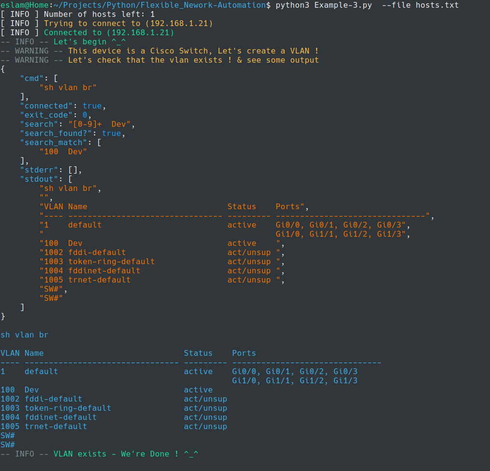
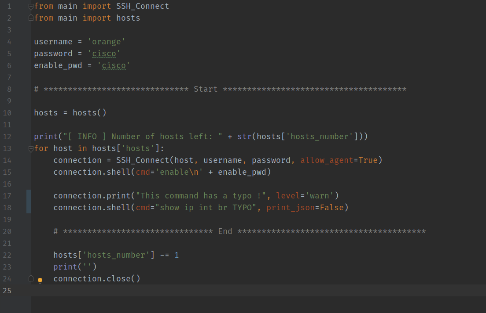
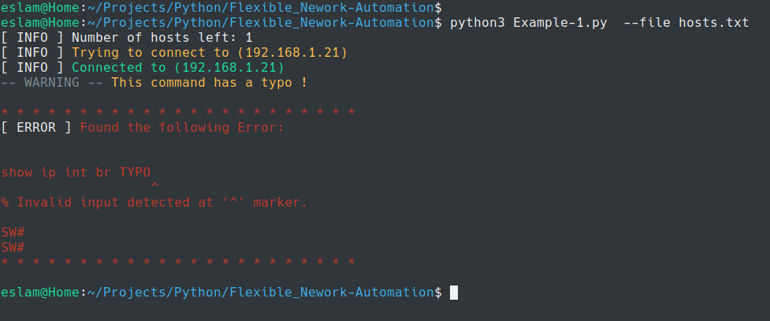

# Flexible_Nework-Automation

A Python Class that provides handy Methods that help to make Network Automation with Python easier and more productive.


## Features :sunny:	: 


*As you may know network devices do NOT have the concept of `stderr` & `exit_code`,
when you run a command on a network device you will only get the `stdout`*

:gem: **The `shell` method** can be used to run commands on Network Devices via SSH, Normally it can get `stdout` but it's also  able to get the `stderr` by searching in the `stdout`
and hence it can provide an `exit_code` of `0` or `1` 

:gem: It executes all the commands on a host in ONLY 1 SSH session, It starts the session in the initialization and YOU close it at the end of your script (as provided in the Example)

:gem: Provide nice output in different ways

:gem: You can run a command or load commands from a text file

:gem: ability to search in the output a command with `RegEX`

:gem: ability to use Python conditionals based on the `status code` or the `search output` of a command

:gem: and more :wink:


### Simple Example


Code is [Here](Examples/Example-3.py)




---

### Sample of Fetching `stderr`

Code is [Here](Examples/Example-1.py)








[image-20200608200752632](Examples/Images/image-20200608200752632.png)


---


## Requirements

* Python3


## Installation

* To get started you just need to install the following Python Libraries

```bash
pip3 install pygments
pip3 install paramiko
```

```bash
git clone https://github.com/eslam-gomaa/Flexible_Nework_Automation.git
cd Flexible_Nework_Automation
```

---


## Usage


#### Step 1

> This idea behind this Module is that you can import it within your Python code
* So simply you can create a a python script & import the following:

```bash
touch example.py
vi example.py
```

```python
from main import SSH_Connect # import "SSH_Connect" class
from main import hosts       # import "hosts"       function
```


#### Step 2

> After you write your code, ( [discussed Here](Examples/README.md) )  you can run your script

```bash
python3 example.py --help
```

* `hosts file` is a text file contains a list of the hosts that the script will automate

Example:

> ```bash
> 192.168.1.20
> router1.example.com
> sw1.example.com
> ```

* Then you run your script with `--file` or `-f` to specify the `hosts file`

```bash
python3 example.py --file <Hosts-File>
```


[Eslam Gomaa](https://www.linkedin.com/in/eslam-gomaa/)
