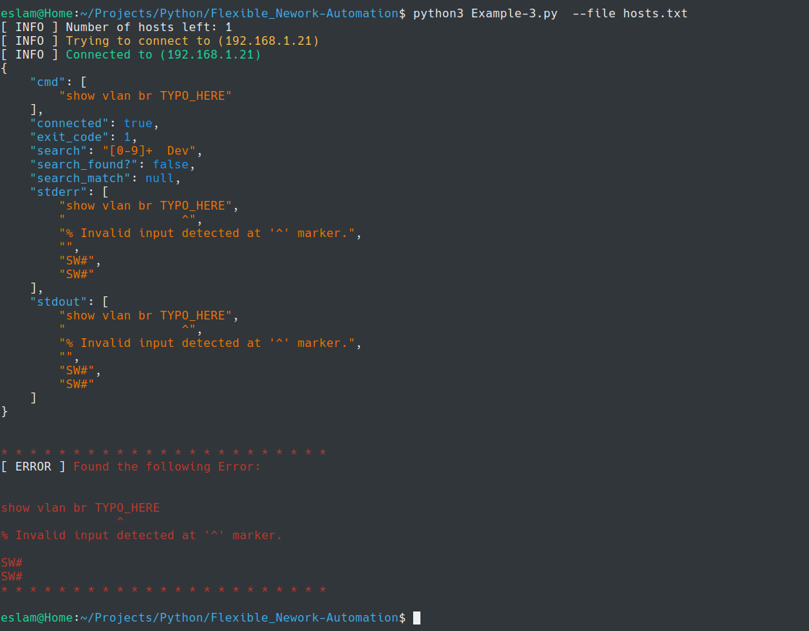

# Flexible_Nework-Automation

A Python Class that provides handy functions that help to make Network Automation with Python easier and more productive.


### Features:


As you may know network devices do NOT have the concept of `stderr` & `exit_code`,
when you run a command on a network device you will only get the `stdout`

:gem: The `shell` method can be used to run command on Network Devices via SSH, Normally it can get `stdout` but it's also  able to get the `stderr` by searching in the `stdout`
and hence it can provide an `exit_code` of `0` or `1` 

:gem: Provide nice output in different ways

:gem: You can run a command or load commands from a text file

:gem: ability to search in the output a command with `RegEX`

:gem: ability to use Python conditionals based on the `status code` or the `search output` of a command

:gem: and more :smile:


### Simple Example


```python
from main import SSH_Connect
from main import hosts

username = 'orange'
password = 'cisco'
enable_pwd = 'cisco'

# ****************************** Start **************************************

hosts = hosts()

print("[ INFO ] Number of hosts left: " + str(hosts['hosts_number']))
for host in hosts['hosts']:

    connection = SSH_Connect(host, username, password, allow_agent=True)
    connection.shell(cmd='enable\n' + enable_pwd)

    connection.print("Let's begin ^_^ ", level='info')
    if connection.shell(cmd="sh version", search='Cisco IOS Software, vios_l2 Software')['search_found?']:
        connection.print("This device is a Cisco Switch, Let's create a VLAN !", level='warn')
        connection.shell(cmd_from_file='./conf_file.txt',)
        connection.print("Let's check that the vlan exists ! & see some output", level='warn')
        if connection.shell(cmd="sh vlan br", print_stdout=True,print_json=True, search='[0-9]+  Dev')['search_found?']:
            connection.print("VLAN exists - We're Done ! ^_^")

    # ******************************* End ***************************************

    hosts['hosts_number'] -= 1
    print('')
    connection.close()
```


[image-20200608205523090](Images/image-20200608205523090.png)




:gem: Nice output
* you can use `print_json` which will get you output like the previous one, (good for debugging)
```python
# ...
connection.shell(cmd='show vlan br TYPO_HERE', print_json=True, search='[0-9]+  Dev')
# ...
```

* Or you can use `print_stdout=True` to get the stdout printed when the command is run

```python
# ...
connection.shell(cmd='show vlan br TYPO_HERE', print_stdout=True, search='[0-9]+  Dev')
# ...
```

[image-20200608201548051](Images/image-20200608201548051.png)


---


The `SSH_Connect` Class provides 2 methods for executing commands on remote hosts/devices
* The `exec_cmd` Method `-->` suitable for running command through ssh on hosts
* The `shell` Method `-->` suitable for running command through ssh on network devices 


### Requirements

* Python3

### Installation

* To get started you just need to install the following Python Libraries

```bash
pip3 install pygments
pip3 install paramiko
```

```bash
git clone https://github.com/eslam-gomaa/Flexible_Nework_Automation.git
cd Flexible_Nework_Automation
```

---

### Usage

#### Step 1

> This idea behind this Module is that you can import it within your Python code
* So simply you can create a a python script & import the following:

```bash
touch example.py
vi example.py
```

```python
from main import SSH_Connect # import "SSH_Connect" class
from main import hosts       # import "hosts"       function
```

#### Step 2

> After you write your code, (discussed later) you can run your script

```bash
python3 example.py --help
```

* `hosts file` is a text file contains a list of the hosts that the script will automate

Example:

> ```bash
> 192.168.1.20
> router1.example.com
> sw1.example.com #
> ```

* Then you run your script with `--file` or `-f` to specify the `hosts file`

```bash
python3 example.py --file <Hosts-File>
```

---

## Module Functions


### Examples


